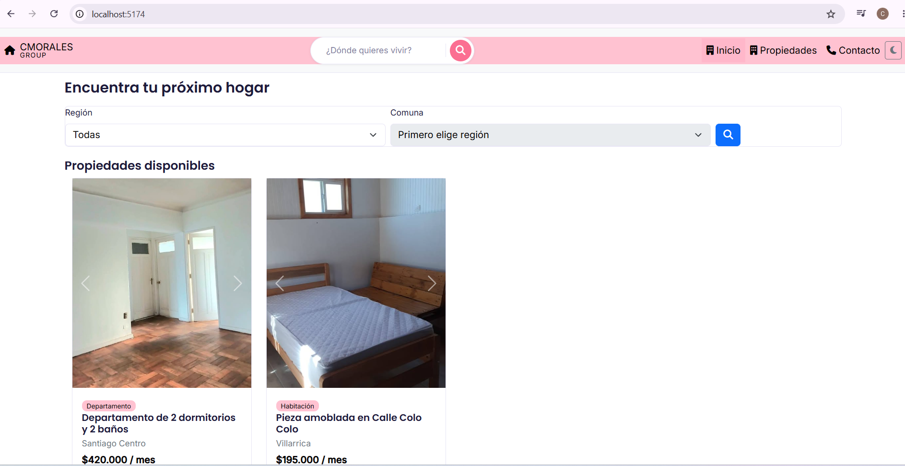
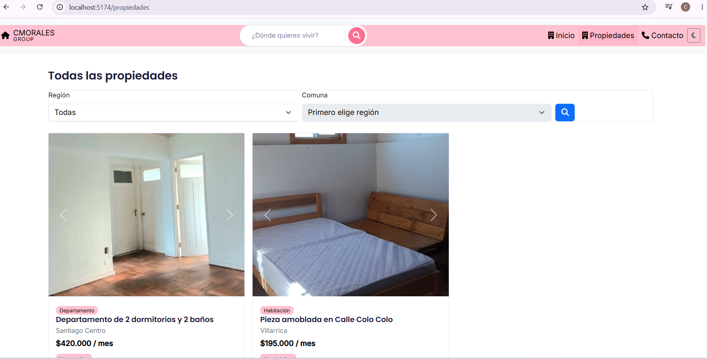
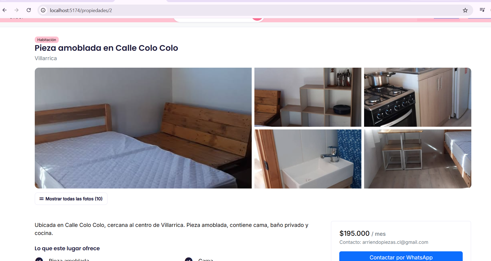

# Arriendo de Casas 🏠

Plataforma web de arriendo de propiedades en Chile, que permite a los usuarios buscar y filtrar propiedades disponibles por región y comuna, ver el detalle de cada una (fotos, características, condiciones, ubicación en mapa) y contactar directamente al arrendador vía WhatsApp o formulario de contacto.

## Descripción

Este proyecto simula un sitio de arriendo de propiedades (casas, departamentos y habitaciones) sin intermediarios. El usuario puede:

- Ver un listado destacado de propiedades en la página de inicio.
- Buscar y filtrar propiedades por región y comuna.
- Ver el listado completo de propiedades disponibles.
- Ingresar al detalle de una propiedad: galería de fotos, mapa referencial, características, condiciones de arriendo y documentos requeridos.
- Cambiar entre modo claro y oscuro.
- Contactar al arrendador por WhatsApp o mediante un formulario de contacto.

## Componentes creados

- **Navbar / HeaderLogo** — logo, nombre de la marca y barra de navegación principal.
- **SearchBar** — buscador rápido dentro del navbar.
- **SearchForm** — formulario de filtro por región y comuna (input/select controlado).
- **PropertyCard** - productCard — tarjeta de propiedad (recibe la propiedad completa por props: título, precio, comuna, tipo, imágenes).
Recibe Props. 
- **PropertyCarousel** — carrusel de fotos dentro de cada `PropertyCard`.
- **PhotoGallery** — galería de fotos en la vista de detalle, con mapa referencial y modal de "ver todas las fotos".
- **MiniMap** — mapa embebido (Leaflet) con la ubicación de la propiedad.
- **AllPhotosModal** — modal que muestra todas las fotos de una propiedad.
- **Home** — página de inicio, renderiza el listado destacado usando `.map`.
- **Properties** — página con el listado completo de propiedades filtrables.
- **PropertyDetail** — página de detalle de una propiedad específica.
- **HowItWorks** — sección explicativa de los pasos para arrendar.
- **ContactCTA** — llamado a la acción de contacto en la página de inicio.
- **Contacto** — formulario de contacto/solicitud.
- **Button** — botón reutilizable (variantes primary / outline-secondary, etc.).
- **ThemeToggle** — botón para alternar entre modo claro y oscuro (maneja estado con `useState`).
- **Footer** — información básica de pie de página.
- **ProductList** se utiliza en varias vistas, por ejemplo Home.
- **Button** componente creado.
- **Footer** componente creado.

## Simulación de datos

Los datos de las propiedades se encuentran en `src/data/propiedades.js`, como un array de objetos. Cada propiedad incluye como mínimo:

- `id`
- `titulo`
- `precio`
- `tipo` (categoría: casa / departamento / habitación)
- `region` y `comuna`
- `imagenes` (array de URLs)
- `descripcion`, `caracteristicas`, `condiciones`, `documentos`, `contacto`, `ubicacion` (opcionales según la propiedad)

Las regiones y comunas disponibles para el buscador están en `src/data/regiones/`.

## Tecnologías usadas

- [React](https://react.dev/)
- [React Router DOM](https://reactrouter.com/)
- [Vite](https://vitejs.dev/)
- [Bootstrap 5](https://getbootstrap.com/) (clases de grid y componentes)
- [React Leaflet](https://react-leaflet.js.org/) + [Leaflet](https://leafletjs.com/) (mapa referencial)
- [Font Awesome](https://fontawesome.com/) (iconografía)
- CSS personalizado con variables (soporte de modo claro/oscuro)

## Instrucciones para ejecutar el proyecto

# 1. Clonar el repositorio
git clone https://github.com/conimorales/G2-2026-Diplomado-FullStack-React.git

# 2. Entrar a la carpeta del proyecto
cd G2-2026-Diplomado-FullStack-React/arriendo-casas

# 3. Instalar dependencias
npm install

# 4. Ejecutar en modo desarrollo
npm run dev

### Dependencias principales instaladas

El comando `npm install` instala automáticamente todo lo listado en `package.json`, entre ellas:

npm install react react-dom react-router-dom leaflet react-leaflet bootstrap

- `react-router-dom` → navegación entre páginas (`/`, `/propiedades`, `/propiedades/:id`, `/contacto`)
- `leaflet` + `react-leaflet` → mapa referencial de cada propiedad
- `bootstrap` → sistema de grid y estilos base (`row`, `col-*`, `btn`, `form-control`, etc.)

> Font Awesome se carga vía CDN en `index.html`, no requiere instalación con npm.

## Capturas de pantalla

### Vista general (Home)

### Listado de propiedades (Propiedades)

### Detalle de propiedad

---

Proyecto desarrollado como parte del Diplomado Full Stack React.
El proyecto esta en proceso de desarrollo, se carga la primera tarea. 

- Barra buscador navbar falta configurar
- Falta mejorar vista contacto 